# 📁 File Upload Web Application  
### (AWS + DevOps | Terraform | Ansible | Jenkins)

## 🔥 Project Overview

This project is a **production-style file upload web application** built using **AWS cloud services** and **DevOps automation tools**.

Users can upload **image / PDF files** through a web interface.  
- Uploaded files are stored securely in **Amazon S3**
- File metadata is stored in **Database**
- Application is deployed on **AWS EC2**
- Complete infrastructure is created using **Terraform**
- Server configuration is automated using **Ansible**
- CI/CD pipeline is implemented using **GitHub + Jenkins**

This project demonstrates **real-world DevOps workflow**, not just theory.

---

## 🏗️ Architecture Overview

### AWS Services Used
- **EC2** – Frontend, Backend, Database, Ansible, Jenkins servers
- **VPC** – Network isolation with public & private subnets
- **S3** – File storage (images / PDFs)
- **CloudFront** – CDN for frontend & file access
- **SNS** – Notifications (optional)

### DevOps Tools Used
- **Terraform** – Infrastructure provisioning
- **Ansible** – Configuration management
- **Git & GitHub** – Source code management
- **Jenkins** – CI/CD automation
- **VS Code** – Development environment

---

## 🌐 Infrastructure Details (Terraform Outputs)

```text
Frontend EC2 (Private IP)  : 10.0.1.141
Backend EC2 (Private IP)   : 10.0.2.173
Database EC2 (Private IP)  : 10.0.3.215
Ansible EC2 (Public IP)    : 13.233.114.49
CloudFront URL             : dx9okb1mt21ue.cloudfront.net
S3 Bucket                  : file-upload-dbdb4fe2
SNS Topic ARN              : arn:aws:sns:ap-south-1:266731137793:file-upload-topic

```
---
## End-to-End AWS DevOps Architecture Diagram
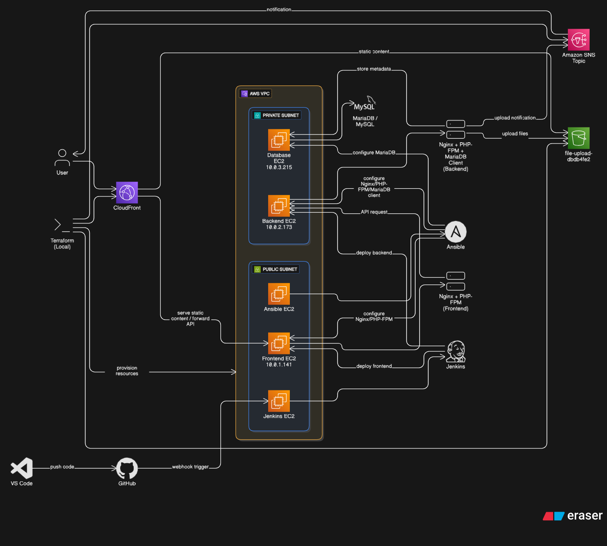
---

---

# Terraform Infrastructure – Detailed Explanation

## What this Terraform Code Creates

This Terraform configuration creates a **complete AWS infrastructure** required for the File Upload Web Application.

---

## End-to-End terraform Architecture Diagram
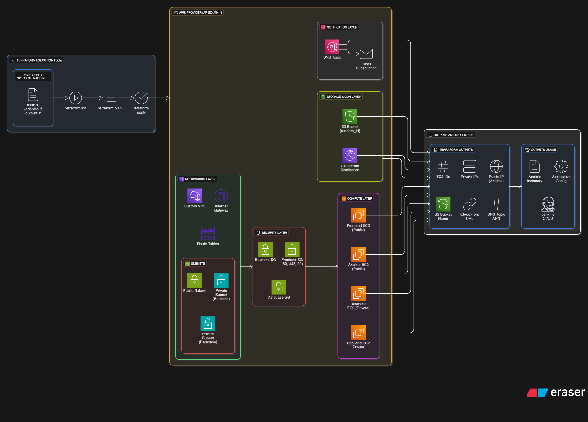
---

## 1. Provider Configuration
- Uses **AWS Provider**
- Region: `ap-south-1 (Mumbai)`
- All resources are created in this region.

---

## 2. Networking (VPC)
### Resources Created:
- **Custom VPC**
- **3 Subnets**
  - Public Subnet → Frontend, Ansible
  - Private Subnet 1 → Backend
  - Private Subnet 2 → Database
- **Internet Gateway**
- **Route Tables**
  - Public Route Table with Internet access
  - Private Route Table for internal communication

Purpose:
- Isolates backend & database from public internet
- Follows AWS security best practices

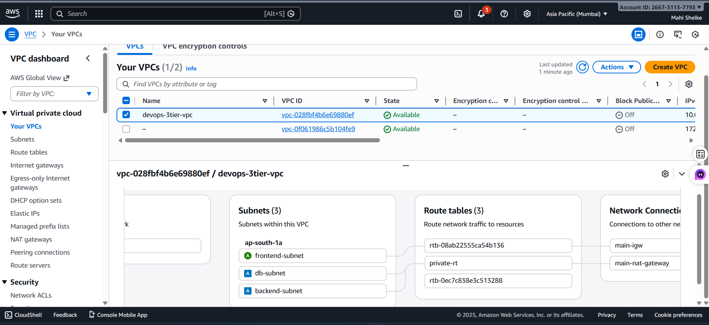

---

## 3. Security Groups
### Created Security Groups:
- Frontend SG
  - Allows HTTP (80), HTTPS (443), SSH (22)
- Backend SG
  - Allows traffic only from Frontend SG
- Database SG
  - Allows MySQL (3306) only from Backend SG

Purpose:
- Restricts access between layers
- Prevents direct public access to DB

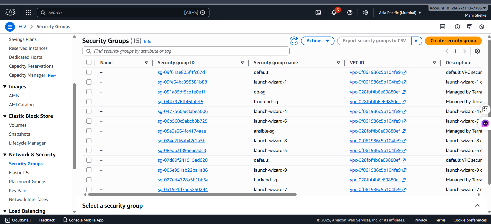

---

## 4. EC2 Instances
### Instances Created:
- **Frontend EC2**
  - Runs Nginx + PHP-FPM
  - Private IP exposed via CloudFront
- **Backend EC2**
  - Handles file upload logic
- **Database EC2**
  - Runs MariaDB
- **Ansible EC2**
  - Used for configuration management

All EC2 instances:
- Created using Terraform
- Later configured using Ansible

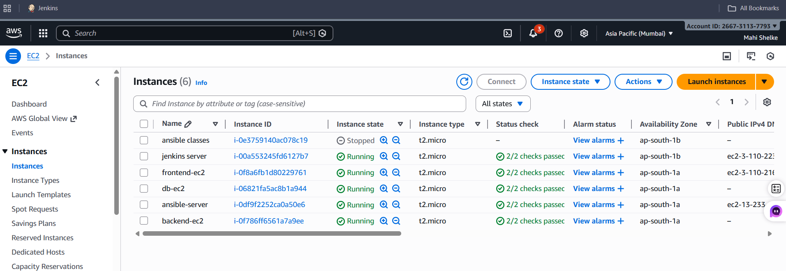

---

## 5. S3 Bucket
- Creates a **unique S3 bucket**
- Used to store:
  - Images
  - PDF files
- Bucket name generated using `random_id`

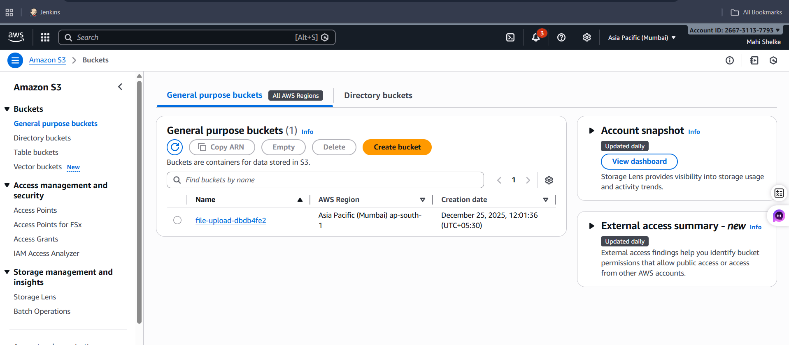

---

## 6. CloudFront Distribution
- CloudFront CDN created in front of S3
- Provides:
  - Faster access
  - Secure file delivery

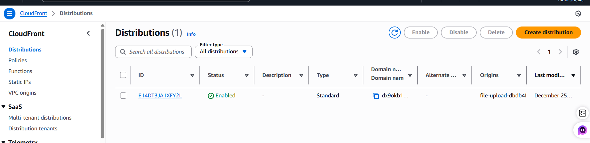

---

## 7. SNS Topic
- SNS topic created for notifications
- Email subscription configured
- Can be used for:
  - Upload alerts
  - Deployment notifications

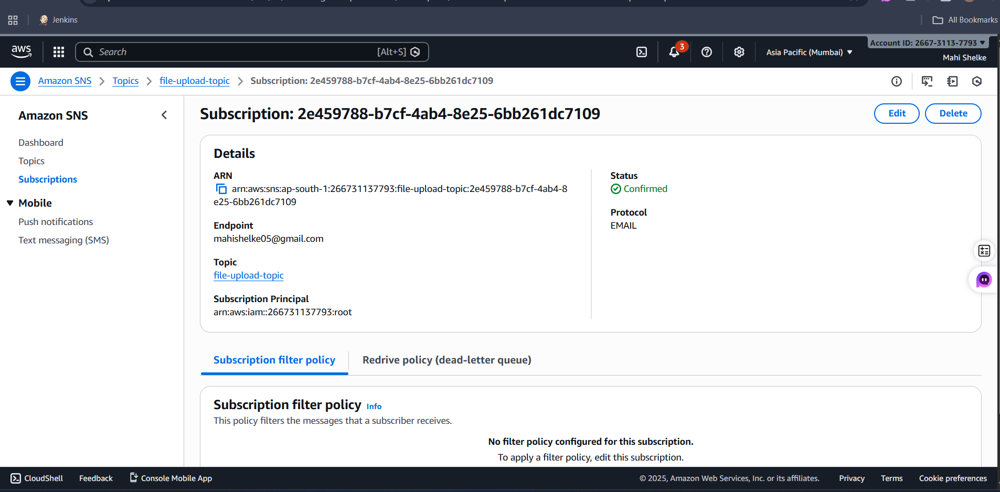

---

## 8. Variables (variables.tf)
- Region
- Instance type
- CIDR blocks
- Admin email
- Key pair name

Benefit:
- Easy environment change
- No hardcoded values

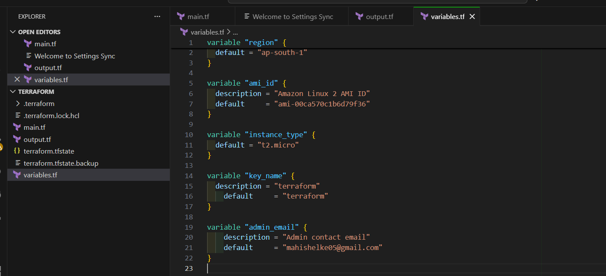

---

## 9. Outputs (outputs.tf)
After `terraform apply`, following outputs are shown:
- EC2 Instance IDs
- Private IPs
- Public IP (Ansible)
- S3 Bucket Name
- CloudFront URL
- SNS Topic ARN

These outputs are used in:
- Ansible inventory
- Application configuration
- Jenkins pipeline

---

## Terraform Execution Commands

```bash
terraform init
terraform plan
terraform apply
```

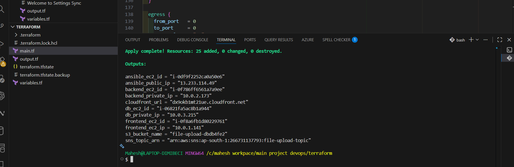

---

## Why This Setup Is Production Ready
- Secure VPC design
- Private backend & database
- Infrastructure as Code
- Easy to scale

---

# Next Steps Ansible


## Ansible Configuration Management – Step by Step Explanation

## Overview

After Terraform completed infrastructure provisioning, a **dedicated Ansible server** was launched.
This server is responsible for **configuration management** and **software installation** on all target servers.

Ansible is used to:
- Configure Frontend server
- Configure Backend server
- Configure Database server
without logging manually into each server.

---

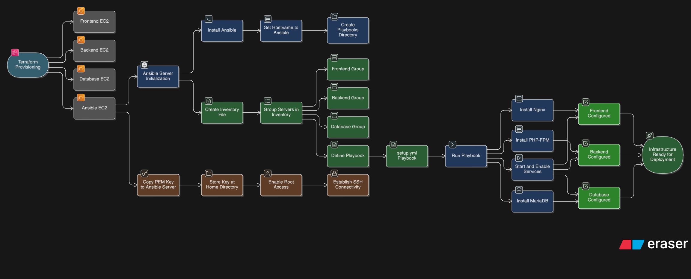

---

## Step 1: Ansible Server Creation (Using Terraform)

Terraform launches an EC2 instance for Ansible and installs Ansible automatically using `user_data`.

### User Data Script Used:
```bash
#!/bin/bash
hostnamectl set-hostname ansible
yum update -y
yum install ansible -y
mkdir -p /etc/ansible/playbooks
```

### What this does:
- Sets hostname to `ansible`
- Updates system packages
- Installs Ansible
- Creates directory for playbooks

---

## Step 2: SSH Key Setup

Terraform-generated key (`terraform.pem`) is copied to Ansible server:

```bash
scp -i terraform.pem terraform.pem ec2-user@<ANSIBLE_PUBLIC_IP>:/home/ec2-user/
```

Then switched to root user:
```bash
sudo -i
```

This key is used to connect securely to all target servers.

---

## Step 3: Inventory File (inventory.ini)

The inventory file defines **target servers** and connection details.

### inventory.ini
```ini
[frontend]
10.0.1.141 ansible_user=ec2-user ansible_ssh_private_key_file=/home/ec2-user/terraform.pem

[backend]
10.0.2.173 ansible_user=ec2-user ansible_ssh_private_key_file=/home/ec2-user/terraform.pem

[db]
10.0.3.215 ansible_user=ec2-user ansible_ssh_private_key_file=/home/ec2-user/terraform.pem
```

### Explanation:
- Servers are grouped logically (frontend, backend, db)
- Uses private IPs for internal communication
- Uses SSH key authentication (no passwords)

---

## Step 4: Ansible Playbook (setup.yml)

This playbook installs and configures required services on all servers.

### setup.yml – What it does:
- Runs on frontend, backend, and db servers
- Installs:
  - Nginx
  - PHP-FPM
  - MariaDB (on backend & db)
- Starts and enables required services
- Applies consistent configuration across servers

### Key Benefits:
- No manual server login
- Idempotent execution (safe to re-run)
- Faster server setup
- Production-style automation

---

## Step 5: Running the Playbook

Command used to execute playbook:
```bash
ansible-playbook -i inventory.ini setup.yml
```
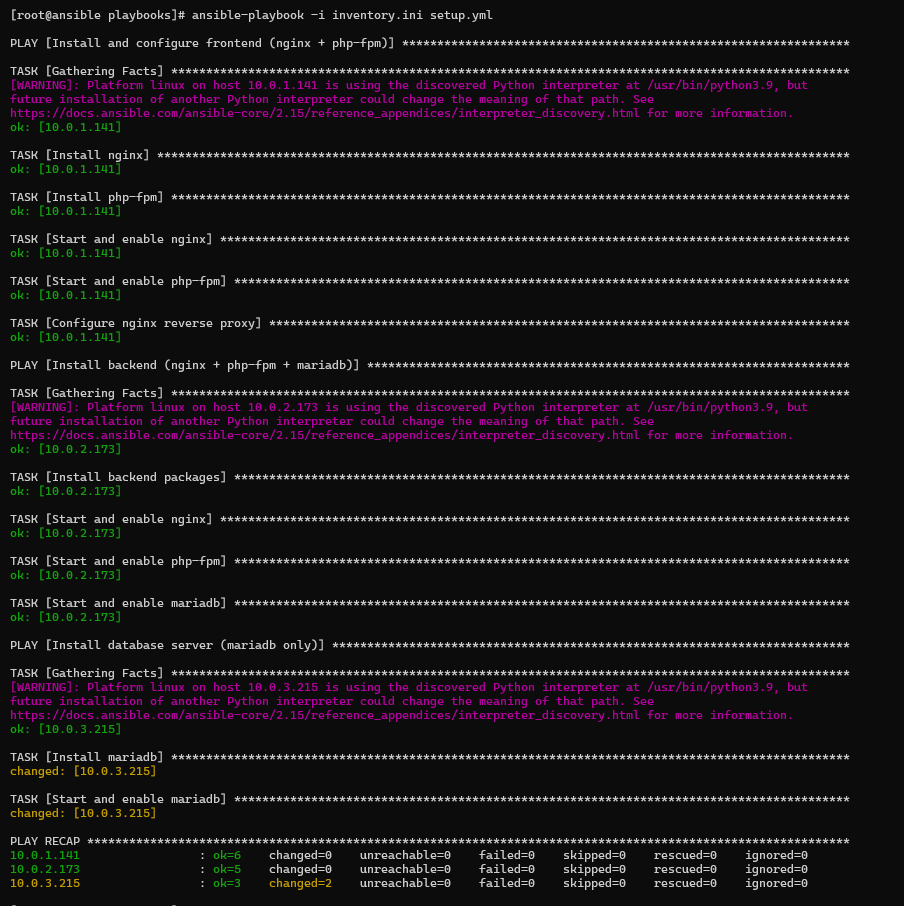

### Result:
- Frontend server ready with Nginx + PHP-FPM
- Backend server ready with Nginx + PHP-FPM + DB client
- Database server ready with MariaDB
- All services enabled and running

---

## Ansible Workflow Summary

1. Terraform creates Ansible EC2
2. Ansible installed automatically via user_data
3. SSH key copied to Ansible server
4. Inventory file defines target servers
5. Playbook executed
6. Servers configured automatically

---

## Why Ansible in This Project?

- Agentless configuration management
- Secure SSH-based automation
- Easy scaling to multiple servers
- Industry-standard DevOps practice
- Interview-ready implementation

---

# Next Steps VS Code -> Git -> GitHub .
---

## Source Code Management – VS Code, Git & GitHub Workflow

## Overview

This step explains how **application source code** is developed and managed using **VS Code, Git, and GitHub**.

In this project:
- Frontend and Backend code are developed separately
- Each component has its **own folder and GitHub repository**
- Git is used for version control
- GitHub is used as a central code storage platform
- This setup supports CI/CD automation using Jenkins (next step)

---
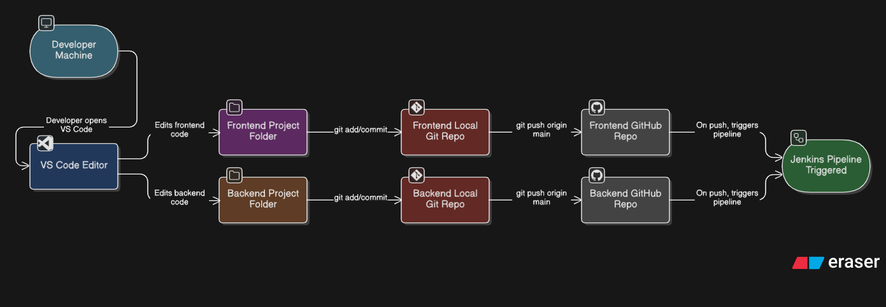

---

## Tools Used

- **VS Code** – Code editor for development
- **Git** – Version control system
- **GitHub** – Remote repository hosting

---

## Project Code Structure

```text
developer-machine/
│
├── frontend/
│   ├── index.php
│   ├── assets/
│   └── .git/
│
├── backend/
│   ├── upload.php
│   ├── config.php
│   └── .git/
```

Each folder is a **separate Git repository**.

---

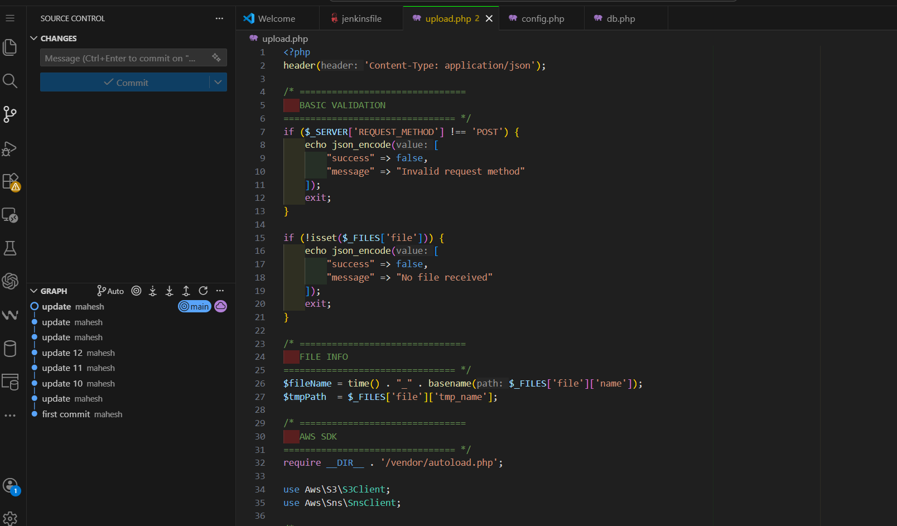

---
## GitHub Repository Structure

- Frontend Code → Separate GitHub Repository
- Backend Code → Separate GitHub Repository

This separation allows:
- Independent deployments
- Better version control
- Clean CI/CD pipelines

---

## Step-by-Step Developer Workflow

### Step 1: Code Development in VS Code
- Developer opens VS Code
- Writes frontend code (UI, forms, validations)
- Writes backend code (file upload logic, S3 integration, DB logic)

---

### Step 2: Initialize Git Repository

Inside each project folder:

```bash
git init
```

This creates a local Git repository.

---

### Step 3: Track Changes

```bash
git status
git add .
git commit -m "Initial commit"
```

- `git add .` → Adds all changes
- `git commit` → Saves snapshot of code

---

### Step 4: Connect to GitHub Repository

```bash
git remote add origin https://github.com/<username>/<repo-name>.git
```

Frontend and Backend use **different GitHub repositories**.

---

### Step 5: Push Code to GitHub

```bash
git branch -M main
git push -u origin main
```

Code is now:
- Safely stored on GitHub
- Ready for CI/CD pipeline trigger

---

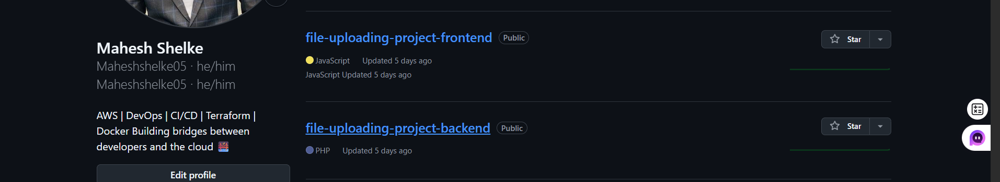

---

## Workflow Summary

1. Developer writes code in VS Code
2. Git tracks code changes
3. Code pushed to GitHub
4. GitHub stores versioned source code
5. Jenkins uses GitHub as source for deployment

---

# Next steps Jenkins CI/CD Pipeline

# Jenkins CI/CD Pipeline – Step by Step Explanation

## Overview

This step explains how **Jenkins** is used to implement a **CI/CD pipeline** for automatic deployment
of frontend and backend applications.

In this project:
- Jenkins server is created **manually** on AWS EC2 (Ubuntu)
- Jenkins pulls code from GitHub
- Jenkins deploys code to Frontend server via SSH
- Frontend server further connects to Backend (private EC2) for backend deployment

This setup reflects a **real-world DevOps deployment flow**.
---

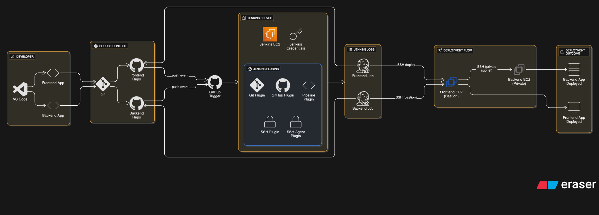

---

## Step 1: Jenkins Server Setup (Manual)

### Actions Performed:
- Launched Ubuntu EC2 instance manually
- Connected using SSH
- Installed Jenkins on Ubuntu
- Started and enabled Jenkins service

Jenkins UI accessed via:
```
http://<JENKINS_PUBLIC_IP>:8080
```

---

## Step 2: Jenkins Plugin Installation

The following plugins were installed:

- Git
- GitHub
- Pipeline
- SSH
- SSH Agent

Purpose:
- Git/GitHub → Source code integration
- SSH/SSH Agent → Secure remote deployment
- Pipeline → Jenkinsfile based CI/CD

---

## Step 3: Jenkins Credentials Configuration

### Credentials Added:
- SSH private key for Frontend server
- SSH private key for Backend server (private access)
- GitHub access credentials (if required)

After adding credentials:
- Jenkins restarted to apply changes

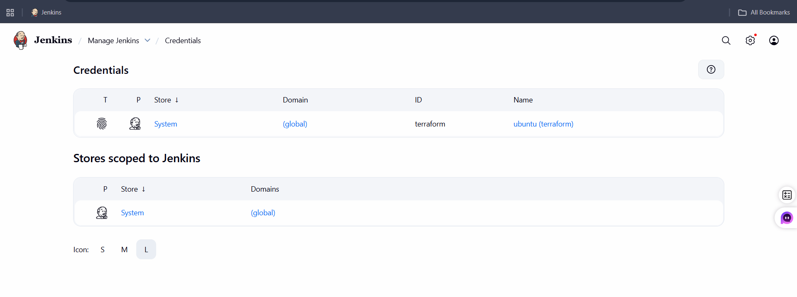

---

## Step 4: Jenkins Jobs Creation

Two separate Jenkins jobs were created:

### 1. Frontend Job
- Connected to Frontend GitHub repository
- Uses Jenkinsfile from frontend repo
- Deploys code to Frontend EC2 server

### 2. Backend Job
- Connected to Backend GitHub repository
- Uses Jenkinsfile from backend repo
- Deploys code to Backend EC2 server

---

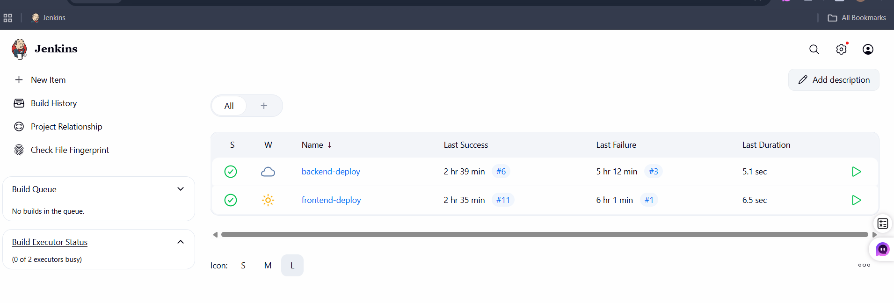
---

## Step 5: Jenkinsfile (Pipeline Code) Explanation and Outputs

Jenkins pipeline is defined using **Jenkinsfile** stored inside each GitHub repository.

### Common Pipeline Stages:
- Checkout Code from GitHub
- Connect to target server using SSH
- Deploy latest code
- Restart required services

## frontend and backend server ssh 

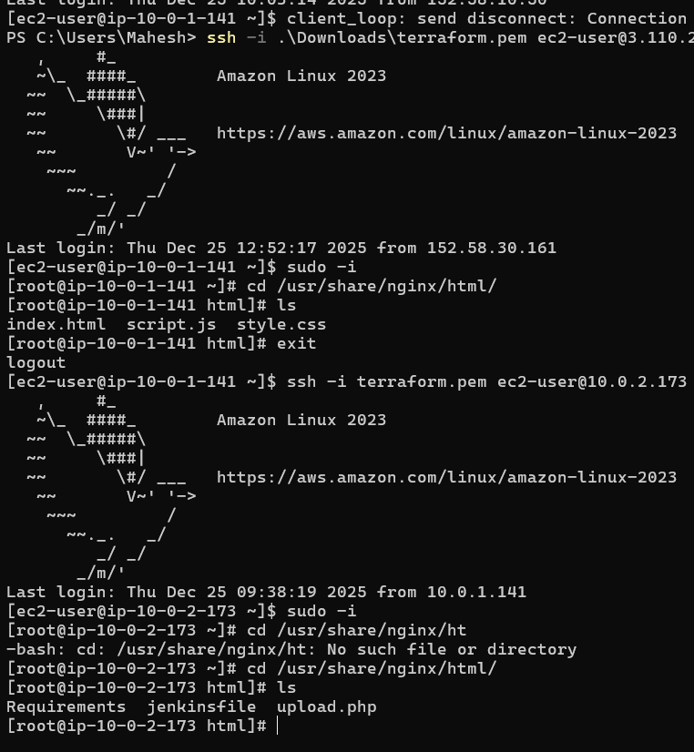

---

## Deployment Flow Logic

### End-to-End Flow:
1. Developer pushes code from VS Code
2. Code stored in GitHub repository
3. Jenkins pipeline is triggered automatically
4. Jenkins connects to Frontend EC2 using SSH
5. Frontend server deploys frontend code
6. Jenkins again connects to Frontend server
7. From Frontend server, SSH connection is made to Backend EC2 (private IP)
8. Backend code is deployed securely
9. Deployment completes successfully

---

# Application Integration – Frontend, Backend & Database Connectivity

## Overview

This step explains how **Frontend, Backend, and Database** are connected together
even though they are running on **separate EC2 servers**.

All communication is done securely using **private IPs**, following real-world
production architecture.

Configuration is handled using:
- **Ansible** (for Nginx proxy configuration)
- **Application code changes** (backend & database connection)

---

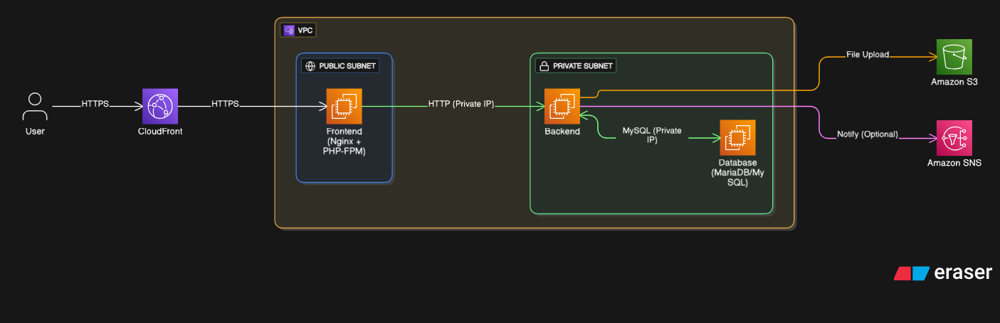

## Architecture Summary

- Frontend Server → Public-facing (via CloudFront)
- Backend Server → Private subnet
- Database Server → Private subnet
- All internal communication uses **private IP addresses**

---

## 1️⃣ Frontend ↔ Backend Connection (Nginx Proxy)

### Problem
Frontend and Backend are on different servers.
Frontend should not directly expose backend to the internet.

### Solution
- Used **Nginx reverse proxy**
- Configured via **Ansible**
- Frontend forwards requests to Backend using **private IP**

### Flow
```
User → CloudFront → Frontend Nginx → Backend (Private IP)
```

### Key Point
- Backend remains secure in private subnet
- Frontend acts as entry point

---

## 2️⃣ Backend ↔ Database Connection

### Database Setup (Database Server)
- Database created manually
- User created with password
- Table created for file metadata

### Backend Configuration
In backend application code (`upload.php` or config file):
- Database server **private IP** is used
- Database name, username, password configured

Example (conceptual):
```php
$db_host = "10.0.3.215";   // Database private IP
$db_name = "file_upload_db";
$db_user = "app_user";
$db_pass = "********";
```

### Result
- Backend connects securely to Database
- No public exposure of database

---

## project complete screenshots
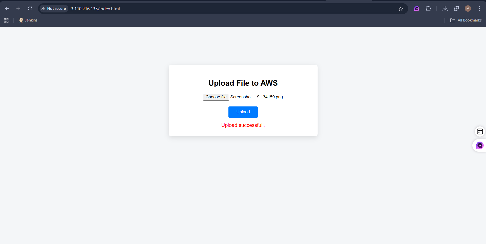
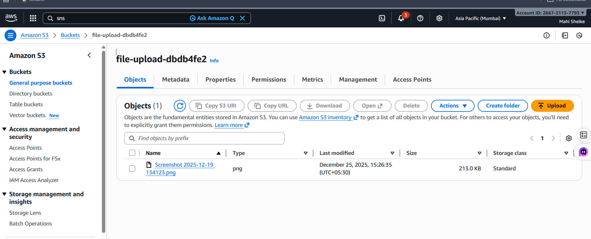

---

# Challenges Faced & Solutions Implemented

This section documents **real problems faced during the project** and how they were resolved.
It highlights **practical DevOps troubleshooting experience**.

---

## 1️⃣ Terraform Region Selection Issue

### Problem
AWS resources were not launching correctly due to **incorrect or missing region configuration**.

### Root Cause
- Region not explicitly defined
- AMI incompatibility with region

### Solution
- Defined correct AWS region in `variables.tf`
- Selected **ap-south-1 (Mumbai)** region
- Verified AMI compatibility

### Outcome
Terraform ran successfully and all resources were created.

---

## 2️⃣ Ansible Not Running (SSH Key Issue)

### Problem
Ansible playbook execution was failing with SSH errors.

### Root Cause
- SSH key (`terraform.pem`) was not present on Ansible server
- Authentication failure

### Solution
- Copied SSH key to Ansible server using SCP
- Updated inventory file with correct key path

```bash
scp -i terraform.pem terraform.pem ec2-user@<ANSIBLE_IP>:/home/ec2-user/
```

### Outcome
Ansible playbooks executed successfully.

---

## 3️⃣ SSH Access Issue (Frontend → Backend & Database)

### Problem
Frontend server could not SSH into Backend and Database servers.

### Root Cause
- Backend & Database in private subnet
- SSH key not available on Frontend
- Missing security group rules

### Solution
- Temporarily stored SSH key on Frontend EC2
- Allowed SSH access from Frontend security group
- Used Frontend as **bastion/jump host**

### Outcome
SSH connectivity was successfully established.

---

## 4️⃣ Application Coding Issues

### Problem
Basic coding errors during development:
- PHP syntax issues
- File upload logic errors

### Solution
- Debugged logs
- Fixed code logic
- Corrected permissions

### Outcome
Application started functioning correctly.

---

## 5️⃣ Service & Connectivity Issues

### Problem
Frontend, Backend, and Database were not communicating properly.

### Root Cause
- Incorrect private IPs
- Nginx proxy misconfiguration
- Database credential mismatch

### Solution
- Configured Nginx reverse proxy via Ansible
- Updated backend code with correct IPs
- Verified database access

### Outcome
End-to-end application flow worked successfully.

---

## 🎯 Key Learnings

- Real-world DevOps troubleshooting
- SSH & networking understanding
- Secure private subnet communication
- Production-ready debugging skills

---

## Interview Tip

> “I faced multiple real-world issues related to SSH, networking, and configuration and resolved them using DevOps best practices.”

---

## Author

Mahesh Shelke  
AWS | DevOps Engineer
